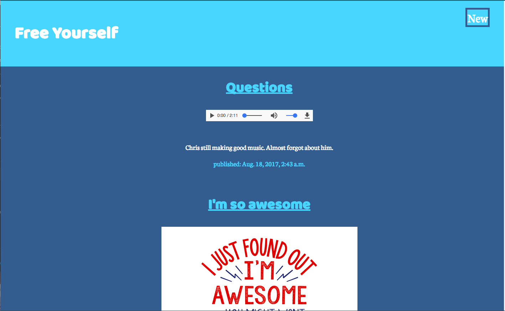
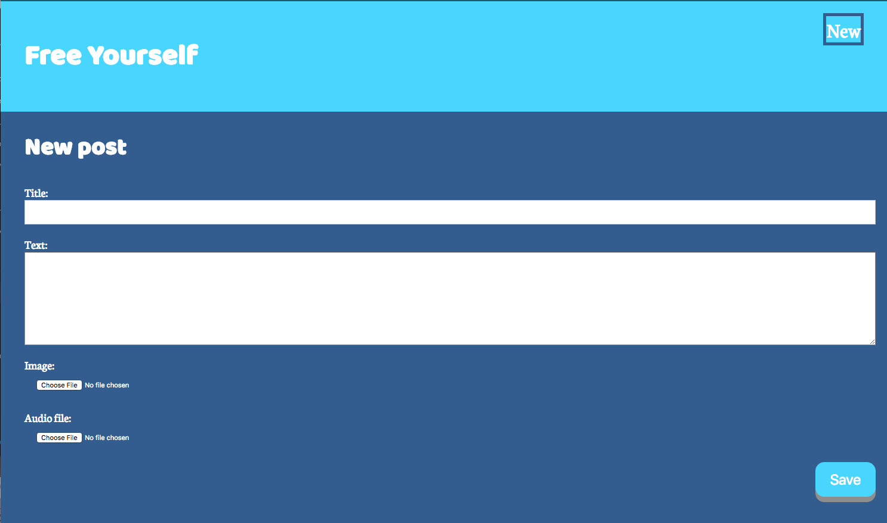
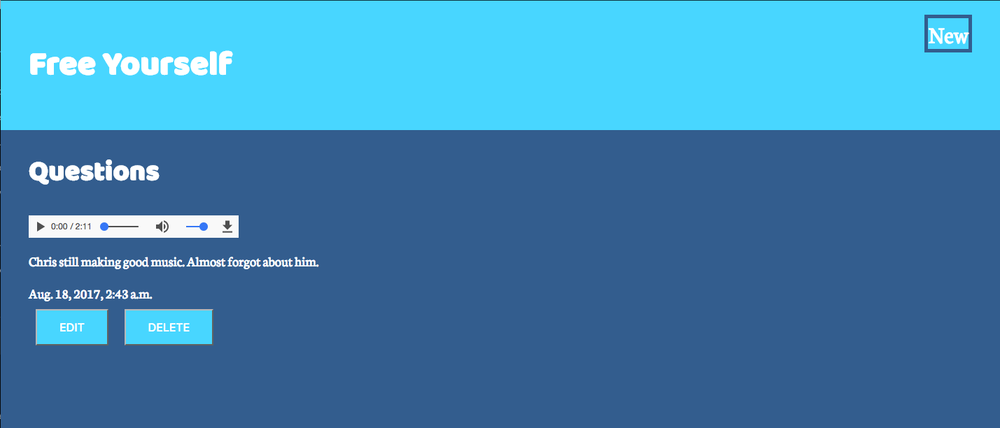
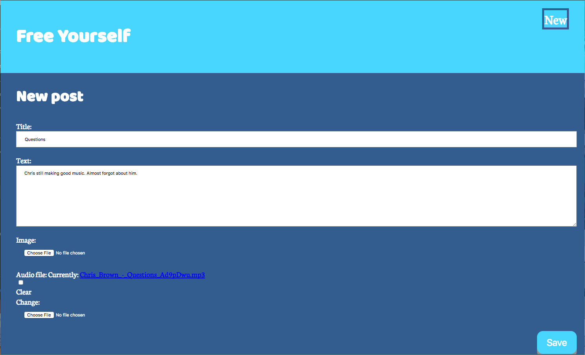

# Free Yourself
This is a blog page I created while learning Python and Django. With this blog you cab create text, video, and audio post. You can add, delete and update post as well as get all the post you have created. I created this blog page because I have been wanting to start blogging but not wanting to put my thoughts on my social media platforms, so I thought why not make my own blog for me.

## Technology Used
**FrontEnd**: CSS, HTML, Python <br/>
**BackEnd**: Django, PostgreSQl, Psycopg2 <br/>
**Deployment**: Heroku <br/>

## Run Locally
```sh
$ git clone https://github.com/patricewhite/free-yourself.git
```
```sh
$ cd free-yourself
```
create and start a a virtual environment
```sh
$ python3 -m venv env
$ source env/bin/activate
```
Install the project dependencies
```sh
$ pip install -r requirements.txt
```
create a file named "secrets.sh"

obtain a secret from MiniWebTool key and add to secrets.sh
export SECRET_KEY='<secret_key>'

add secrets.sh to .gitignore file

create a postgres db and add the credentials to settings.py

DATABASES = {
    'default': {
        'ENGINE': 'django.db.backends.postgresql_psycopg2',
        'NAME': 'db_name',
        'USER': 'name',
        'PASSWORD': '',
        'HOST': 'localhost',
        'PORT': '',
    }
}

then run
```sh
$ python manage.py migrate
```
create admin account
```sh
$ python manage.py createsuperuser
```
then
```sh
$ python manage.py makemigrations blog
```
to makemigrations for the app

then again run
```sh
$ python manage.py migrate
```
to start the development server
```sh
$ python manage.py runserver
```
open `127.0.0.1:8000/` on your browser to view app

## ScreenShots
### All Post
 <br/>
### New Post
<br/>
### Post Details
<br/>
### Edit Post
<br/>
